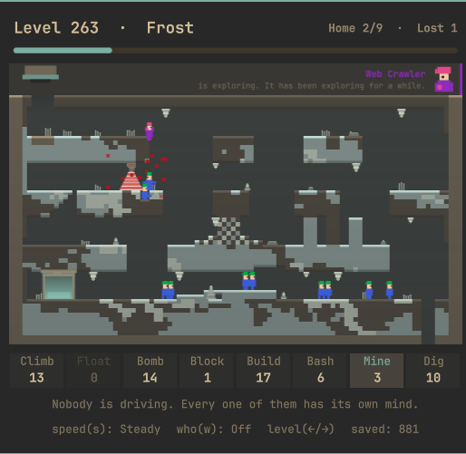
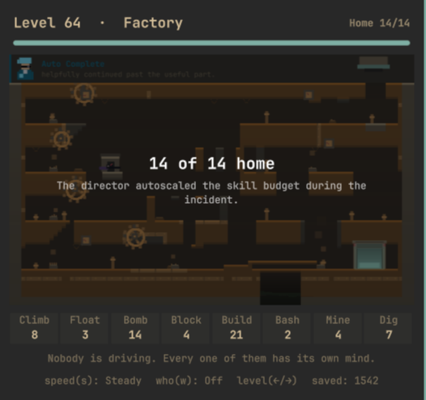
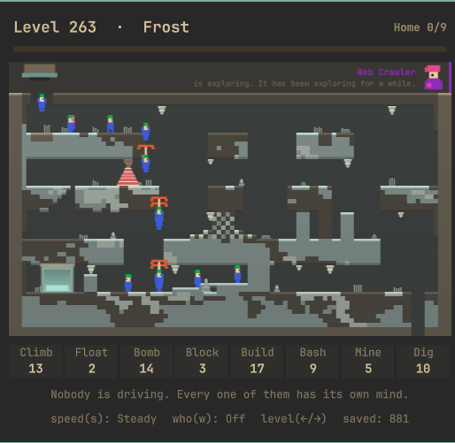

# Oh No! More Agents



Not a game. A level carves itself out of solid earth, a hatch opens, and a
dozen-odd small creatures with green hair have to work out for themselves how
to get from there to the exit — bashing through what's in the way, bridging
what isn't there, climbing what's too tall, and putting an umbrella up when
the drop is too far.

They are agents in the strict sense. No supervisor, no plan beyond the next two
body-lengths, no memory of the last wall, no idea where the exit is. Each one
looks at what's in front of it, picks the cheapest tool that fits, and commits
completely. About two thirds of them make it. The rest are a learning
experience for nobody in particular.

You don't play it. You watch it. That's the whole thing.

It lives in the bar next to [Snake](https://github.com/jhgundersen/omarchy-snake-plugin)
for the same reason Snake does: the build is compiling, the *other* agent is
still thinking, and staring at a progress bar is worse for you than staring at
this. Snake is for when you want something to do. This is for when you
don't.

It's a self-contained `bar-widget` plugin for [Omarchy](https://omarchy.org)'s
shell, in the same style as the built-in Audio, Network, and Bluetooth
widgets: one bar icon, one popup panel.

## Install

```sh
omarchy plugin add https://github.com/jhgundersen/omarchy-oh-no-more-agents-plugin.git --enable
```

Or, to hack on it locally, clone it straight into your plugins directory:

```sh
git clone https://github.com/jhgundersen/omarchy-oh-no-more-agents-plugin.git ~/.config/omarchy/plugins/jhgundersen.oh-no-more-agents
omarchy plugin enable jhgundersen.oh-no-more-agents
```

## Uninstall

```sh
omarchy plugin remove jhgundersen.oh-no-more-agents
```

Or disable it without removing the files:

```sh
omarchy plugin disable jhgundersen.oh-no-more-agents
```

## Watching

Click the umbrella in the bar. A level generates, the hatch opens, and it
runs. When everybody who's getting home is home, it pauses on the result for
a few seconds and the next level carves itself. Left open, it just keeps
going.

- **Space**, or clicking the board — pause and resume
- **`←` / `→`** (or `h` / `l`), or the `level` label — step back and forward
  through levels
- **`n`** / **`p`** — next / previous level
- **`r`** — regenerate the current level from scratch
- **`s`**, or the `speed(s)` label — Calm, Steady, or Brisk
- **`w`**, or the `who(w)` label — float a label over each agent: what it's
  doing when it's doing something, and who it is the rest of the time
- **Esc** — close the panel

Each level asks for a number rather than for everyone — between about two
thirds and four fifths of the colony, shown in the header as what's needed.
That's how the original did it, and it's what makes room for an agent to
sacrifice itself.

A level that doesn't reach its target is attempted again, up to three times,
before it moves on. A retry keeps the same ground and sends a different colony
at it, with a little more in the toolbar — replaying it unchanged would be
pointless, since everything here is deterministic and the run would fail again
tick for tick. Roughly two in five failed levels come good on a second or third
go; the header shows which try you're watching.

Nothing in here assigns a skill. There's no cursor, no toolbar you can click,
no way to help. The toolbar under the board is a read-out, not a control: it
shows what this level was issued and what's left of it, and flashes when one
of them goes out. When it reads 0 it means 0 — everything that hands out a
skill, including the director that steps in on a stalled level, draws from the
same budget and is refused when it's empty.

## The clock

A level gets 110 seconds. If they haven't made it by then the nuke goes off:
every agent still out there gets a five-second fuse, a few frames apart, and
the level ends in a ripple of small explosions.

It's set to the shortest limit that never cuts short a level still making
progress. Levels that are going to work are done well inside it, and the ones
that trip it are stuck for good rather than slow — raising it to 140 or 170
seconds nukes exactly the same attempts and only makes you wait longer to
watch it. The countdown appears in the header for the last thirty seconds; a
nuked level is then retried like any other failure.

## How they work it out

Each agent senses only the terrain within a couple of body-lengths of
itself — is there a wall, how thick is it, how tall, is there floor ahead,
how far down, is there anything to land on within a bridge's reach — and
picks the cheapest tool that fits what it found:

| What it runs into | What it does |
| --- | --- |
| A wall thin enough to see daylight through | **Bash** through it |
| A wall too thick to bash, with a clear top | **Climb** over it |
| A gap with the far side in reach | **Build** a bridge |
| A drop too far to survive | **Float** down |
| A drop with nothing at the bottom at all | **Block** — and stay there, so nobody else walks in |
| Steel | Turn around. Nothing gets through steel |
| Nothing, for long enough | **Dig** or **Mine** downward and find out |

An agent only ever turns round at a wall, at a blocker, or at an edge it
won't step off. Landing doesn't turn it — it keeps whatever way it was facing,
same as the original.

Every one of the eight costs one out of the level's budget, every time it's
used, and when a budget runs dry the rule falls through to the next option —
which is where the improvisation comes from. A level bridged on one run gets
bashed through on the next once the builders are gone.

That includes climbing and floating, which is a deliberate break with the
original. There, an agent made a climber stays one for life — but there a
*player* picks which one gets it and for which wall, so the permanence is a
resource being spent. With nobody choosing, the first agent to meet a wall
took a climber and then had every wall on the level for free, which quietly
deleted the decision from everything downstream. Paying per climb puts it back:
run out, and the wall in front of you is a problem again.

Being stingy with them turns out to be free. Between three and eighteen
climbers a level, the share of levels that end with everyone home doesn't
budge off 85% — what strands a colony was never the shortage of climbs.
Climbing still turns up in about seven attempts in ten; it just can't carry one
agent from the hatch to the exit any more.

The only thing they know that isn't in front of their faces is which way home
is *vertically* — whether the exit is on this floor, above, or below — which is
what decides between digging down and climbing up when an agent runs out of
ideas. There's no horizontal sense of where the exit is at all. There used to
be, steering them on landing, and it had to go: the corridors zigzag, so on
every other floor the exit lies back the way they came, and following it walked
the colony to the wrong end of the level and held it there.

## Personalities

Every agent gets one for life, drawn when it steps out of the hatch. They
don't change what an agent can do — the senses and the rules are identical
for all of them — only which answer it reaches for when more than one would
work:

| | |
| --- | --- |
| **steady** | No strong opinions. Most of the colony. |
| **brave** | Walks off drops the others bridge, and puts a shoulder into a wall rather than going over it. |
| **cautious** | Bridges gaps it could have jumped, gets its umbrella out with cells to spare, and is the one most likely to stand and block. |
| **curious** | Bored of a corridor soonest, so it's usually the first to decide the way on is *down* and start digging. |
| **stubborn** | Works the same wall long after the others have turned back. |
| **tinkerer** | Cuts its way out sideways where the others drop a shaft, and reaches for tools sooner. |
| **engineer** | Would rather build a way across than fall down one. Bridges almost anything, lays twice as many as anyone else, and takes the umbrella only when there's nothing on the far side to reach. |
| **sentinel** | Blocks at the first excuse, and when the same wall has beaten it enough times it stops trying and plants itself where it stands — which is a problem for everybody behind it, and the reason somebody is about to have to dig. |
| **burrower** | Decides the way on is *down* long before anybody else does. |

On top of the personality each one carries its own small variation, so two
cautious agents aren't the same agent twice: where its bridge-or-jump line
sits shifts a little either way, and one in five reverses its instinct at a
wall outright.

The interesting part is watching two of them arrive at the same ledge and
disagree about it — the cautious one laying a bridge across a drop the brave
one has already walked off. Turn labels on with `w` to see who's who.

They are measurably different rather than differently labelled. Per hundred
agents of each, counting how often each one starts doing something:

| | builds | climbs | bashes | mines | digs | blocks | umbrella |
| --- | --- | --- | --- | --- | --- | --- | --- |
| steady | 24 | 83 | 47 | 5 | 4 | 8 | 51 |
| brave | 18 | 41 | 66 | 2 | 3 | 9 | 47 |
| cautious | 94 | 14 | 31 | 16 | 21 | 8 | 193 |
| curious | 63 | 73 | 50 | 10 | 15 | 8 | 53 |
| stubborn | 15 | 37 | 64 | 2 | 1 | 12 | 54 |
| tinkerer | 37 | 83 | 48 | 13 | 1 | 8 | 55 |
| engineer | 97 | 7 | 26 | 8 | 5 | 12 | 47 |
| sentinel | 26 | 94 | 42 | 5 | 10 | 20 | 49 |
| burrower | 82 | 81 | 57 | 20 | 20 | 9 | 48 |

The engineer builds fourteen times more often than it climbs; the cautious one
gets through nearly two umbrellas each; the sentinel blocks two and a half
times as often as anybody else. Getting that last one to work took noticing
that `standDown` has to come in *under* `turnLimit` — the escape check zeroes
the turn count the moment it hits the limit, so a stand-down threshold above it
could never be reached and the sentinel blocked no more often than anyone.

Nothing here makes an agent less safe: a personality only ever brings an
umbrella out *earlier* than the point where a landing would kill, never
later. Bravery buys a longer walk, not a longer fall.

## Special agents

Something over half of colonies contain exactly one. A special **cannot touch
the toolbar at all** — no climbs, no bridges, no umbrella, nothing from the
budget the other fourteen are sharing — and in exchange it has one move it can
make forever, rationed by a cooldown instead of by a meter.

| | |
| --- | --- |
| **Max Tokens** | Empties the entire magazine into the wall. A basher's tunnel, in one shot |
| **Vector Van Damme** | Does not destroy the wall. Picks it up and puts it down further along |
| **Web Crawler** | Goes up the wall and crosses upside down — but only where the roof actually leads past the thing in the way |
| **Random Forrest** | Fells the wall: everything above knee height comes down and what's left is a step |
| **Sim Anneal** | Melts a disc, the roundest hole on the board |
| **Prompt Injection** | Plants a charge in the rock and the rock does as it's told |
| **Gradient Descent** | Straight down, and only when down is where home is |
| **Context Window** | Needed one cell of room and opens two hundred |
| **Guard Rails** | The only one that adds: a slab laid straight out |
| **Hal Lucination** | Steps through the wall, reports it solved, helps nobody |

It is known by its colour. Every other agent is the same green and blue on
purpose, so the one that isn't reads as the one that isn't from across the room
— with a pip on the shoulder in its second colour, its name over its head with
labels on, and a card up in the open sky saying who is down there.

This is the second version. The first had twenty, and it did not work. Twelve
of them had no animation at all — they were passives, and "that one is slightly
teal and walks a bit quicker" is not a character at four hundred pixels across
— while the eight that did have one fired it seventy or eighty times a level,
which is not a signature move either, it is a tic. Ten now, every one of them
something you can watch happen, and a cooldown long enough that the move is
something you wait for.

The cooldown runs whether or not the move achieved anything, which is not an
implementation detail: charging it only on success left a special swinging at
steel free to swing again immediately, and that alone was the difference
between about a dozen moves a level and eighty-five.

A move has to be worth making, not just possible. The Web Crawler is the clearest
case: it will not leave the floor unless there is a run of ceiling ahead of it,
and before it climbs it picks out where it means to come down — the first place
ahead, at the height it set off from, that is actually standable. So it goes up
to cross something and comes down on the far side of it, about ten cells later,
rather than being on the ceiling for its own entertainment. It also takes to the
roof at a gap now, which is the crossing it was always for and the one situation
it was never offered.

None of them winds up on a move that cannot work. Every move can be asked the
question before it is committed to — is there anything here this would actually
shift — so Vector Van Damme looks at a block too big to move and walks away
rather than kicking it and whiffing.

That check has to be honest in both directions. Written too strictly it stopped
Random Forrest doing anything at all: its move only worked on a free-standing
pillar, of which this generator makes almost none, so it refused ninety-seven
times out of a hundred. A move nobody ever sees is the same as no move.

Every one also keeps a shovel for when the wall was never the problem — and
digging with it does **not** count as getting somewhere. Treating it as progress
reset the patience counter every time, so a special that dug, fell, walked, got
stuck and dug again never accumulated any idle time and could never be written
off. It could loop like that for a whole level, which is the one agent on the
board you would definitely notice doing it. Most
moves cut sideways, so a special boxed into a pocket with the way on underneath
it fired into the same steel wall until the level timed out — two thirds ended
up condemned rather than home. The move is for walls; the shovel is for
everything else.

## Levels



Levels are a pure function of their number — level 42 always generates the
same level, with the same agents in the same order — so `←` and `→` walk a
fixed catalogue rather than reshuffling. The board starts as one solid mass of
earth and the level is *carved* out of it: four corridors, each walked in the
opposite direction to the one above. Each corridor's floor simply stops at the
handoff, so the way on is over the edge.

Which way the serpentine runs is a coin toss, so about half of levels mirror:
the hatch is as often in the top right as the top left, and the exit follows it.
That was fixed for a long time, which meant the two things a viewer looks at
first were in the same two corners of every level ever generated. Where each
corridor's floor gives out varies too, so corridors are not all the same length
and the obstacles along them are not all at the same three positions.

Two or three obstacles sit along each corridor, every one a shape with a known
answer:

| | |
| --- | --- |
| **wall** | A plug spanning the corridor. Bash through it |
| **collapse** | The same answer with a better shape: a cave-in, debris ramping up to a full-height plug |
| **pillars** | Narrow columns, each its own separate bash |
| **towers** | Columns of two minds — some reach the ceiling, some are stubs you stride over |
| **chasm** | Floor gone, far side at the same height. The builder's |
| **gap** / **pit** | Floor removed, with a soft landing or steep sides |
| **step** | The floor rises more than a stride, ceiling lifted to match. The climber's |
| **cliff** | A drop past two floors. Umbrellas |

The mix is weighted rather than even, and every level is guaranteed a chasm —
left to the dice, the most distinctive thing any of them does turned up in
barely half of levels, and a mix with as many climbable faces as anything else
made the whole board read as walking, climbing and falling.

Dirt, rock and ore all give way to tools; steel never does. The last few paces to
the exit are walled off with plain dirt, so every level ends with something to
get through — and that wall stops two rows short of the ceiling, so it has two
answers rather than one.

The last corridor is deliberately lighter than the others — at most one
obstacle besides that wall. Every other corridor has a way onward, so failing
something there costs a detour; the last one has only the exit, so failures
there compound into a level where nobody gets home at all.

Four biomes cycle with the level number — **Cavern**, **Ruins**, **Frost**,
**Foundry** — each pulling the earth, sky and portal toward a different tone
of the active Omarchy theme. Change your theme and the board changes with it.

Each biome also furnishes its corridors: stalagmites and grass in the cavern,
fallen columns in the ruins, ice needles in the frost, pipes and sparks in the
foundry, with things hanging from the ceilings. None of it is in the terrain
grid — decor lives in its own list, so an agent walks straight through a
stalagmite and nothing in the brain can see one. That is the only reason it can
be scattered this freely; anything put in the grid is a wall to somebody. The
renderer checks the cell underneath is still there before drawing each piece,
so a corridor that gets dug out loses its furniture along the way.



The agents themselves are the one deliberately un-themed thing on the
board: green hair, blue robe, orange umbrella, fixed. At sixteen pixels tall
that silhouette is the only thing making them read as a doomed colony rather
than as animated debris.

### The earth itself

The board is built as strata: five or six layers with wavy boundaries, seams of
ore running through them, lenses of the wrong material, and a crumbled scatter
along every boundary so no two layers meet on a clean line. A corridor cut
through six layers is worth more to look at than the same corridor cut through
one, and a fresh tunnel exposes whatever it happens to pass through.

All of it is free. Dirt, rock and ore are one material to everything that makes
a decision — nothing in the brain compares a cell against any of them, since
solidity asks only whether a cell is empty and every skill asks only whether it
is steel. That is checked rather than assumed: every level is played twice, once
as built and once with all three flattened to dirt, and across 300 runs the two
agree on every agent saved, every one lost, the tick they finished on, and the
shape of the ground they left behind.

Getting that to hold took a fix. `terrainVersion` drove both the repainting and
the director's sense that anything was happening, so laying a brick of dirt over
a cell of rock — which changes nothing about the level — read as earth being
moved and bought a stalled level another twenty seconds. Those are two counters
now: one moves on any change, the other only when solid becomes empty or empty
becomes solid.

Measured over 200 levels played the way the panel plays them, retries and all:
**91% reach their target**, 74% of every agent released gets home, over an
average attempt of about 50 seconds.

The number worth watching while tuning any of this is none of those: it is how
much of an agent's life is spent walking somewhere it has already been. That
was a tenth of all agent-time, which is what "they run out of skills and pace"
looks like when you count it. Condemning agents stuck on the spot, a bomb per
agent, and loosening the two budgets that actually ran dry — climbers, which
were empty in half of all attempts, and bashers — took it down by two thirds,
and pulled eleven seconds off the average attempt on the way.

### The blocker

Most corridors have a hole cut clean through the bedrock at the near end —
behind where the colony drops in, on the opposite side from the handoff
they're walking towards. Agents land facing away from it, so the only ones
who ever meet it are those who turned back from an obstacle, and for them it
is genuinely lethal. The first to reach it stands and turns the rest around,
which costs the level nothing because the way on was always the other way.

A blocker never stands down. It has given up going home so the ones behind it
don't walk into a hole, and that cost is the whole point of the skill — letting
it wander off after a decent interval, which is what this used to do, took the
cost out of the only skill that's made of cost. When everyone who was going to
get home has, the blockers still standing light their own fuses, which is
exactly what a player does at the end of a level and the honest end of the
bargain they made.

That's also why a level has a *target* rather than asking for everyone (see
above): a blocker doesn't come home, so on any level that posts one, "everyone
home" isn't a target, it's a contradiction. Asking for all of them made 86% of
levels unwinnable the moment an agent stood in a gap to save the others.

The bottomless drop itself sits on the **last** corridor, and only there. It has
to be cut through the bedrock to read as bottomless — the depth check scans real
terrain and stops at the first solid cell — and a shaft like that, cut from a
middle corridor, runs through the floor of every corridor beneath it on its way
down. It punched a hole three cells wide at whatever column happened to be near
the side wall, and on level 298 that column was where the last corridor starts
and where the colony lands: sixteen agents out of sixteen walked into it on two
attempts running, and the level could not be finished at all. Anywhere a drop
can be bottomless, it is also above somewhere the colony has to walk. On the
last corridor there is nothing underneath to ruin, and its near end is still
dead ground, so a blocker there still costs nothing.

They're only ever posted at a drop with no bottom, never at one that's merely
lethal. An agent that meets a killing drop with no umbrella left has already
solved its own problem by turning round, and an edge like that can sit on the
route — where a blocker that never moves would wall the level shut for good.

It took two goes to get the placement right. Putting the same hazard *on* the route is much
worse — a blocker at a void the colony has to cross walls off the only way
forward, and all-home fell from 90% to 65%. And for a long time it couldn't
fire at all: the rule keys off a drop with no bottom, but out-of-bounds reads
as solid steel to everything else in the simulation, so a hole through the
bedrock still reported a floor at the bottom of it and the drop was never
bottomless. One line, and the skill went from never appearing to standing in
about half of all levels.

### Dangers

About half of levels have one, and never more than one. Twenty-one kinds — a
hanging machine gun, a sniper with a laser sight, plates that bring spikes up
under you, a sweeping beam, a crusher, a steam vent, an electric fence — built
out of five mechanisms, because twenty separate pieces of clockwork would be
twenty separate ways for a level to become unwinnable, where twenty settings of
the same five are twenty things to look at:

| | |
| --- | --- |
| **watch** | dormant until somebody comes within reach, then winds up and fires |
| **snipe** | picks one target it has line of sight to, anywhere down the corridor |
| **beam** | fires on its own schedule whether or not anyone is there |
| **plate** | armed by being stood on, and goes off a moment later |
| **cycle** | never triggers and never stops — just keeps its own time |
| **field** | always live, and the only kind with no safe moment at all |

Everything except `field` rests between firings for long enough to walk
through, and everything winds up first, visibly, for long enough to read. Both
are what make a danger sitting on the route fair rather than arbitrary.

All twenty-one have their own fixture and their own effect. They were built on
four shared looks, which meant eight of them drew as the same beam — and a
hazard you cannot tell from the last one is, from where you sit, the same
hazard. The sniper has a barrel and a scope, the bear trap's jaws are open
until they aren't, the sawblade rises out of its slot turning, the crusher
comes down on two rams, the pendulum swings.

The sniper is the only one that reaches past its own fixture. It picks the
nearest agent it can actually see — a long way off, but only in a straight
unobstructed line — holds a sight on it while it winds up, and fires once.
Walking behind something while it aims is a real escape, and the shot is
followed by a five-second reload, which is what stops it being a corridor
nobody may enter: it gets one, and everybody else gets a window.

The colony knows nothing about it. A danger is scenery until somebody is
present when it goes off — that first death is the only thing in the entire
simulation that is learned rather than sensed. After that, an agent walking
toward it *while it is live* treats it exactly like a drop with no bottom: the
first one to arrive stands and blocks, and the rest turn around. When it goes
quiet they walk through.

That last detail is load-bearing. Backing off from a danger that is merely
*resting* would mean backing off forever, and since the answer is a blocker and
a blocker never stands down, the route would be sealed and the level lost.

Getting them anywhere near anybody took three goes. The first two put the
danger on the dead ground at the far end of a corridor, reasoning that anything
the colony walls off must not be on the way — which was right about blockers
and wrong about everything else, because counting where agents actually spend
their time showed the outer five columns of a middle corridor get essentially
no traffic at all. Twenty-one kinds of trap, and a kill in one attempt out of
ten. They sit on the route now, and the timing does the work the placement was
supposed to.

They are placed just past an obstacle, in the direction of travel. Everyone who
gets through a wall arrives at the same few cells on the far side of it, which
makes that the densest traffic on the corridor and the only spot where the
timing is funny: nine seconds of bashing, and then the machine gun. Moving them
there took attempts that draw blood from a quarter of danger levels to better
than a third.

They cost about three points of levels cleared, which is the price of the
feature. Half of levels have one, three-quarters of those get seen working.

### Going in circles

An agent that has stopped getting anywhere tends to pace, and pacing is the
least interesting thing on the board — it also burns the level's clock while
the rest of the colony waits for something to happen. So positions are counted
into buckets five cells wide, and an agent that re-treads one five times is
condemned and handed a bomb.

The counter is wiped every time an agent gets closer to home, which is what
makes it safe to be this quick: hitting the threshold means five passes over
the same few cells with *no progress at all* in between, never five passes in
the ordinary course of a long level. A tight pace between two walls trips it in
about six seconds. A wide lap of a whole corridor takes nearer twenty-five, by
which time the patience timer has usually already offered it a shovel.

Counting buckets only ever notices an agent that *moves* between them, so there
is a second way to be condemned: walking, and no closer to home for a good
while past the point where the shovel was offered and didn't help. Without it,
an agent wearing a hole in a single five-cell stretch — turning on the spot
between a wall and a blocker — re-tread nothing, counted nothing, and stood
there until the level timed out. Which is the one everybody notices, precisely
because it never goes anywhere at all.

A bomb rather than simply deleting it, because the explosion is the useful
part. An agent only ever paces somewhere it could not get past, so the hole it
leaves is in exactly the wall that stopped it. Nobody is told; the others walk
into the same place later and find it different, which is the first time the
"no memory, no plan, no communication" premise has worked in their favour.

It costs a bomber from the same budget as everything else, and that budget is
one per agent released. Any smaller number is a level where the thing that ends
the pacing has itself run out — which is exactly the level you sit and watch
nothing happen on. At one each it runs dry in about one attempt in fifty,
against one in four when it was a flat three to five.

It fires on 45% of attempts, about one and a half agents each time. That is not
free — it kills agents who occasionally would have come good — but it takes the
share of attempts that run all the way into the nuke from 39% down to 30%, and
a level ends about two seconds sooner on average.

### The hop

Agents can stride two cells, and climb with a skill, and between those two there
was nothing at all. So a two-cell pocket, a ledge three high, or a blocker with
a wall a stride behind it were all places to bounce back and forth in forever.
Counted, four percent of all agent-time was spent frozen inside a single cell,
and a special could hit a wall a hundred and fifty times in a level without ever
getting anywhere.

They can hop now: three cells of lift, free, no skill, no budget. It is not a
solution to anything the level puts in the way on purpose — three cells is under
the height of every obstacle here — it only gets an agent out of somewhere it
should never have been stuck in. And an agent still in the same cell well after
a hop would have been tried stops waiting for the patience timer, which is
twenty-eight seconds away, and digs.

Frozen time went from 4.4% to 2.6%. What is left is mostly an agent pinned
between a drop it will not take and something it will not pass, which is a
decision rather than a bug.

## When it goes wrong

A brain this local can occasionally paint itself into a corner, so two things
watch for it. A **director** notices when a level has gone a stretch with no
agent saved, none lost, and not a cell of earth moved, and quietly hands the
agent nearest the exit whatever tool would get it moving. And any individual
agent that has gone twenty seconds without getting any closer to home stops
waiting for the budget to allow it and digs.

Neither is a script. They don't know the route either — they just refuse to
let you sit watching something that has stopped happening.

## Persistence

Which level you're on, how many agents you've got home across every session,
levels cleared, total watching time, and your speed and label settings survive
shell restarts — kept as JSON in
`~/.local/state/omarchy/plugins/jhgundersen.oh-no-more-agents/state.json`,
written when a level finishes, when a setting changes, and when the panel
closes.

## Files

- `manifest.json` — plugin manifest (`bar-widget` kind)
- `Panel.qml` — bar icon, panel chrome, the clock that drives the sim, and
  persistence. The only file here that knows what Omarchy is
- `Sim.js` — terrain, level generation, personalities, and the brain. Pure JS,
  knows no colors
- `Draw.js` — pixels. Never mutates the world
- `Palette.js` — five theme colors in, canvas colors out
- `preview.png`, `screenshot-complete.png`, `screenshot-floaters.png`
- `LICENSE` — MIT

## The one real hazard of sharing files

The three `.js` files carry no imports, which is what lets them run in both
places — and it also means they **cannot call each other**. In a browser all
three land in one global scope, so a call from one into another resolves and
looks perfectly correct. In QML each `.js` is its own scope, and the same call
throws a `ReferenceError` at runtime.

That cost a real bug. `Draw.js` called `Sim.js`'s `specialSpec()` to look up a
special agent's colours. The web version was flawless. The bar plugin drew **no
agents at all** on any level that had a special — the exception came out of
`drawActors` before the loop that draws them — which looked for all the world
like a level-number bug, since levels without a special were fine.

Anything one file needs from another travels on the world object now: `w.k` for
the geometry constants, `w.specialSpec` for that one. `check-core-refs.py`,
which `sync-agents.sh` runs on every sync, refuses to copy a core file that
reaches into another. And Qt can be run headlessly, which is how it was
actually found:

```sh
QT_ASSUME_STDERR_HAS_CONSOLE=1 QT_QPA_PLATFORM=offscreen qml6 main.qml
```

## It also runs in a browser

The three `.js` files carry no QML directives — no `.pragma library`, no
`.import` — and between them they never touch a QML type. That is deliberate:
they draw onto a canvas 2D context, and that API is the same in a browser, so
the identical files run at [jonh.no/agents.html](https://jonh.no/agents.html)
with a page in place of `Panel.qml`. `Panel.qml` and that page are the only
two files that differ between the two.

It's there to be looked at, but it started as a development tool and is still
the reason it exists. Changing anything about how the board looks used to mean
restarting the whole shell to see one pixel — and `.pragma library` meant the
plugin hot reload silently didn't reload these files at all, so the restart was
not optional. In a browser it's a keystroke, and it can render the board under
every Omarchy theme in a second rather than one theme per shell restart.

The web version is where these three are edited; a script copies them here and
refuses to publish either side if the two have drifted apart or if the files
have started declaring the same name twice, which a browser would resolve
silently and badly.

## Name

It's a parody, and the lineage is the point: this is *Lemmings*, the 1991
Psygnosis game, with the player removed. The title is the sequel's — *Oh No!
More Lemmings* — with the noun updated to the one currently being applied to
software that acts without supervision and mostly gets away with it.

No affiliation with anybody who owns anything.

## License

MIT — see [LICENSE](LICENSE). No external dependencies beyond the Omarchy
shell APIs (`qs.Ui`, `qs.Commons`) it runs inside.
